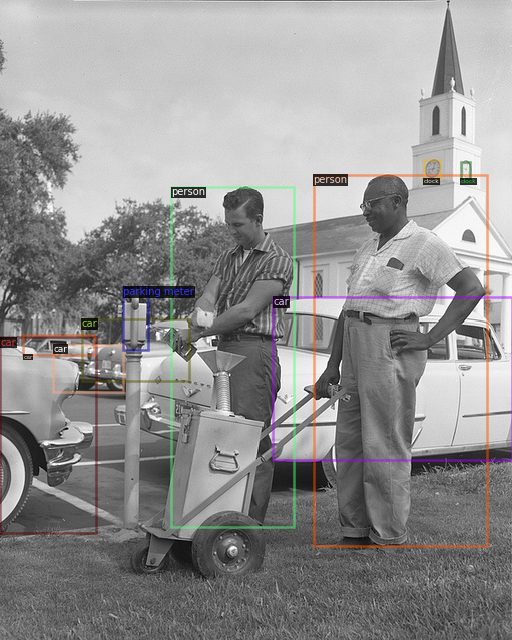
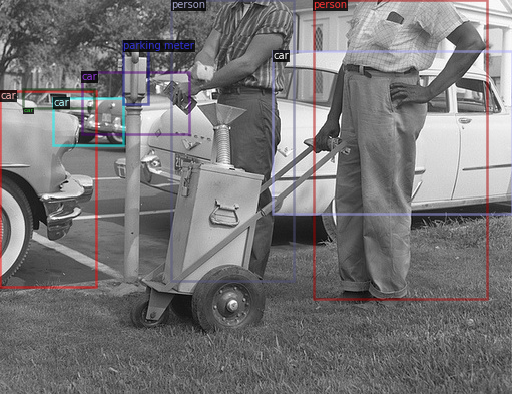
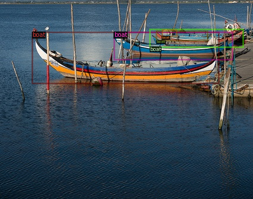
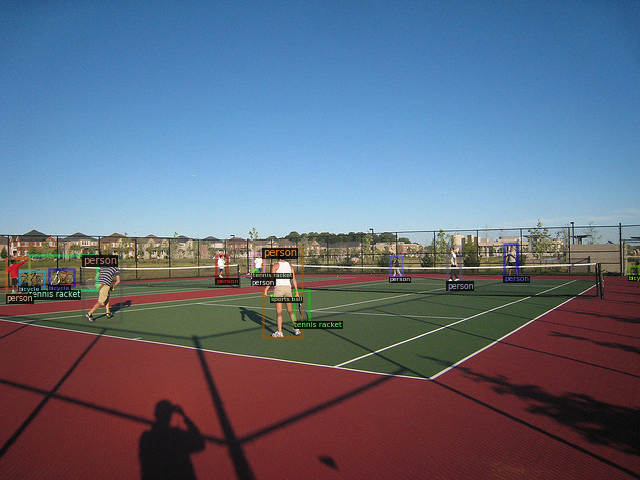
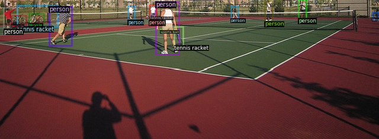

# Sky Crop Dataset
This project is used to create a new dataset from an existing COCO dataset, where the sky is cropped out of
the images. The sky is detected by running a panoptic segmentation on the images and then cropping the lowermost pixel
that contains the sky. Detectron2 segmentation model is used to run an inference on the images.

## Installation 
Run the following python script to install detectron2

```py
!python -m pip install pyyaml==5.1
!pip install CocoDataset==0.1.2
import sys, os, distutils.core
# Note: This is a faster way to install detectron2 in Colab, but it does not include all functionalities.
# See https://detectron2.readthedocs.io/tutorials/install.html for full installation instructions
!git clone 'https://github.com/facebookresearch/detectron2'
dist = distutils.core.run_setup("./detectron2/setup.py")
!python -m pip install {' '.join([f"'{x}'" for x in dist.install_requires])}
sys.path.insert(0, os.path.abspath('./detectron2'))

# Properly install detectron2. (Please do not install twice in both ways)
# !python -m pip install 'git+https://github.com/facebookresearch/detectron2.git'
import torch, detectron2
!nvcc --version
TORCH_VERSION = ".".join(torch.__version__.split(".")[:2])
CUDA_VERSION = torch.__version__.split("+")[-1]
```


### Requirements

```py
# Some basic setup:
# Setup detectron2 logger
import detectron2
from detectron2.utils.logger import setup_logger
setup_logger()

# import some common libraries
import numpy as np
import os, json, cv2, random
from google.colab.patches import cv2_imshow
import copy

# import some common detectron2 utilities
from detectron2 import model_zoo
from detectron2.engine import DefaultPredictor
from detectron2.config import get_cfg
from detectron2.utils.visualizer import Visualizer
from detectron2.data import MetadataCatalog, DatasetCatalog
```
### Dataset download
This command will download the desired COCO dataset or annotations and unzip it
```py
!wget "/path/to/dataset_or_annotations.zip"
!unzip "/path/to/zip.zip"

```
### Dataset registration
This command will register the dataset on a name of your choise
```py
from detectron2.structures import BoxMode
from detectron2.data.datasets import register_coco_instances
args = [
        "/content/annotations/instances_train2014.json",
        "/content/train2014",
        "My_dataset2",
        "/content/sky_cropped/new_image.jpg",
        "/content/annotations/sky_crop_annotations.json"
        ]

path_to_annotations = args[0]
path_to_images = args[1]
dataset_name = args[2]
path_to_new_images = args[3]
path_to_new_annotations = args[4]
register_coco_instances(dataset_name, {}, path_to_annotations, path_to_images)

```

### Loading annotations

```py
from detectron2.data.datasets import load_coco_json
# Load the image and annotation data for the "my_dataset2_train" dataset
dataset_dicts = load_coco_json(path_to_annotations, path_to_images, dataset_name)
# Get the first image and annotation in the dataset
metadata = MetadataCatalog.get(dataset_name)
```

### Generating new dataset

```py
# for every dict from the list perform sky_crop then vizualize
aug = Data_Augmentation()
for i in range(len(dataset_dicts)):
  curr_dict = dataset_dicts[i]
  new_dict = aug.sky_crop(curr_dict)
  img = cv2.imread(curr_dict['file_name'])
  visualizer = Visualizer(img[:, :, ::-1], metadata=metadata, scale=1)
  out = visualizer.draw_dataset_dict(curr_dict)
  cv2_imshow(out.get_image()[:, :, ::-1])
```

### Saving to new json file

```py
with open(path_to_new_annotations, "w") as f:
    # Write the list of dictionaries to the file as JSON
    json.dump(dataset_dicts, f)
```
## Examples

 
 
 
